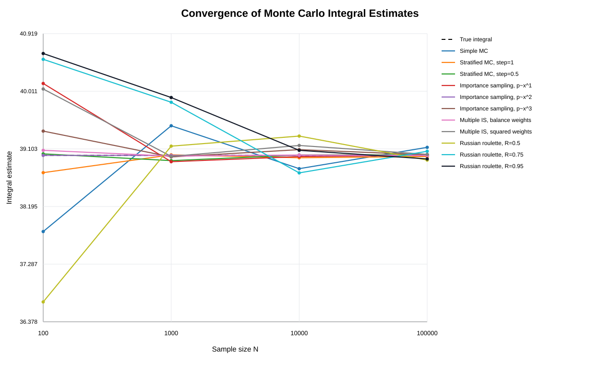
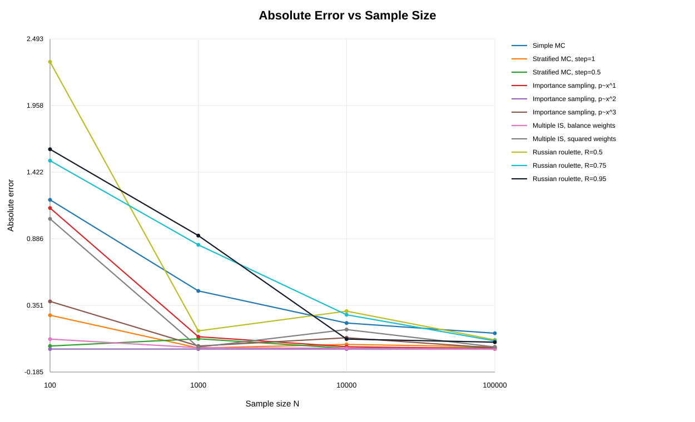

# Лабораторная работа 2

## Расчет интеграла функции методом Монте-Карло

**Цель работы:** изучить базовые методы Монте-Карло для интегрирования функций на заданном интервале, оценить точность интегрирования, преимущества и недостатки методов.

**Заданная функция:**

```text
f(x) = x^2
```

**Интервал интегрирования:**

```text
[2, 5]
```

## Входные данные эксперимента

| Параметр                              | Значение         |
| --------------------------------------------- | ------------------------ |
| Функция                                | f(x) = x^2               |
| Интервал интегрирования | [2.0, 5.0]               |
| Размеры выборки                 | 100, 1000, 10000, 100000 |
| Шаги стратификации           | 1.0, 0.5                 |
| Плотности для importance sampling | x^1, x^2, x^3            |
| Плотности для MIS                 | x^1, x^3                 |
| Пороги русской рулетки    | 0.5, 0.75, 0.95          |

## Аналитическое решение

Интеграл вычисляется по формуле:

```text
I = integral from 2 to 5 of x^2 dx = x^3 / 3 | from 2 to 5
I = (5^3 - 2^3) / 3 = (125 - 8) / 3 = 39
```

Истинное значение интеграла:

```text
I_true = 39
```

## Использованные методы

В работе применены следующие методы:

1. Простое интегрирование методом Монте-Карло.
2. Интегрирование методом Монте-Карло со стратификацией:
   - шаг разбиения 1;
   - шаг разбиения 0.5.
3. Интегрирование методом Монте-Карло с выборкой по значимости:
   - p(x) пропорциональна x;
   - p(x) пропорциональна x^2;
   - p(x) пропорциональна x^3.
4. Интегрирование методом Монте-Карло с многократной выборкой по значимости:
   - веса по средней плотности;
   - веса по среднему квадрату плотностей.
5. Интегрирование методом Монте-Карло с использованием русской рулетки:
   - R = 0.5;
   - R = 0.75;
   - R = 0.95.

Для плотностей p(x)=x, p(x)=x^2, p(x)=x^3 использовалась нормировка на интервале [2, 5], чтобы функции являлись корректными вероятностными плотностями.

Оценка погрешности по заданию:

```text
Delta I = I_true / sqrt(N)
```

## Результаты вычислений

В программе использованы значения числа выборок:

```text
N = 100, 1000, 10000, 100000
```

Для воспроизводимости результатов использован seed генератора случайных чисел:

```text
seed = 42
```

| Метод                   |      N |        I_true |          I_MC | Абсолютная погрешность |      Delta I |
| ---------------------------- | -----: | ------------: | ------------: | ------------------------------------------: | -----------: |
| Simple MC                    |    100 | 39.0000000000 | 37.8003728457 |                                1.1996271543 | 3.9000000000 |
| Stratified MC, step=1        |    100 | 39.0000000000 | 38.7282697977 |                                0.2717302023 | 3.9000000000 |
| Stratified MC, step=0.5      |    100 | 39.0000000000 | 39.0243391200 |                                0.0243391200 | 3.9000000000 |
| Importance sampling, p~x^1   |    100 | 39.0000000000 | 40.1336295044 |                                1.1336295044 | 3.9000000000 |
| Importance sampling, p~x^2   |    100 | 39.0000000000 | 39.0000000000 |                                0.0000000000 | 3.9000000000 |
| Importance sampling, p~x^3   |    100 | 39.0000000000 | 39.3828989233 |                                0.3828989233 | 3.9000000000 |
| Multiple IS, balance weights |    100 | 39.0000000000 | 39.0799322137 |                                0.0799322137 | 3.9000000000 |
| Multiple IS, squared weights |    100 | 39.0000000000 | 40.0465381500 |                                1.0465381500 | 3.9000000000 |
| Russian roulette, R=0.5      |    100 | 39.0000000000 | 36.6915211798 |                                2.3084788202 | 3.9000000000 |
| Russian roulette, R=0.75     |    100 | 39.0000000000 | 40.5140987778 |                                1.5140987778 | 3.9000000000 |
| Russian roulette, R=0.95     |    100 | 39.0000000000 | 40.6059600470 |                                1.6059600470 | 3.9000000000 |
| Simple MC                    |   1000 | 39.0000000000 | 39.4672466606 |                                0.4672466606 | 1.2332882875 |
| Stratified MC, step=1        |   1000 | 39.0000000000 | 39.0086543379 |                                0.0086543379 | 1.2332882875 |
| Stratified MC, step=0.5      |   1000 | 39.0000000000 | 38.9176831669 |                                0.0823168331 | 1.2332882875 |
| Importance sampling, p~x^1   |   1000 | 39.0000000000 | 38.9008458574 |                                0.0991541426 | 1.2332882875 |
| Importance sampling, p~x^2   |   1000 | 39.0000000000 | 39.0000000000 |                                0.0000000000 | 1.2332882875 |
| Importance sampling, p~x^3   |   1000 | 39.0000000000 | 38.9759108377 |                                0.0240891623 | 1.2332882875 |
| Multiple IS, balance weights |   1000 | 39.0000000000 | 38.9894247993 |                                0.0105752007 | 1.2332882875 |
| Multiple IS, squared weights |   1000 | 39.0000000000 | 38.9848034748 |                                0.0151965252 | 1.2332882875 |
| Russian roulette, R=0.5      |   1000 | 39.0000000000 | 39.1459289562 |                                0.1459289562 | 1.2332882875 |
| Russian roulette, R=0.75     |   1000 | 39.0000000000 | 39.8375988419 |                                0.8375988419 | 1.2332882875 |
| Russian roulette, R=0.95     |   1000 | 39.0000000000 | 39.9119601145 |                                0.9119601145 | 1.2332882875 |
| Simple MC                    |  10000 | 39.0000000000 | 38.7908848746 |                                0.2091151254 | 0.3900000000 |
| Stratified MC, step=1        |  10000 | 39.0000000000 | 38.9628290905 |                                0.0371709095 | 0.3900000000 |
| Stratified MC, step=0.5      |  10000 | 39.0000000000 | 39.0064572535 |                                0.0064572535 | 0.3900000000 |
| Importance sampling, p~x^1   |  10000 | 39.0000000000 | 38.9814207221 |                                0.0185792779 | 0.3900000000 |
| Importance sampling, p~x^2   |  10000 | 39.0000000000 | 39.0000000000 |                                0.0000000000 | 0.3900000000 |
| Importance sampling, p~x^3   |  10000 | 39.0000000000 | 39.0908599768 |                                0.0908599768 | 0.3900000000 |
| Multiple IS, balance weights |  10000 | 39.0000000000 | 39.0067513175 |                                0.0067513175 | 0.3900000000 |
| Multiple IS, squared weights |  10000 | 39.0000000000 | 39.1566090592 |                                0.1566090592 | 0.3900000000 |
| Russian roulette, R=0.5      |  10000 | 39.0000000000 | 39.3046647245 |                                0.3046647245 | 0.3900000000 |
| Russian roulette, R=0.75     |  10000 | 39.0000000000 | 38.7245674722 |                                0.2754325278 | 0.3900000000 |
| Russian roulette, R=0.95     |  10000 | 39.0000000000 | 39.0799465476 |                                0.0799465476 | 0.3900000000 |
| Simple MC                    | 100000 | 39.0000000000 | 39.1269244470 |                                0.1269244470 | 0.1233288287 |
| Stratified MC, step=1        | 100000 | 39.0000000000 | 38.9828999994 |                                0.0171000006 | 0.1233288287 |
| Stratified MC, step=0.5      | 100000 | 39.0000000000 | 39.0105377879 |                                0.0105377879 | 0.1233288287 |
| Importance sampling, p~x^1   | 100000 | 39.0000000000 | 39.0035799733 |                                0.0035799733 | 0.1233288287 |
| Importance sampling, p~x^2   | 100000 | 39.0000000000 | 39.0000000000 |                                0.0000000000 | 0.1233288287 |
| Importance sampling, p~x^3   | 100000 | 39.0000000000 | 39.0087918505 |                                0.0087918505 | 0.1233288287 |
| Multiple IS, balance weights | 100000 | 39.0000000000 | 38.9995412830 |                                0.0004587170 | 0.1233288287 |
| Multiple IS, squared weights | 100000 | 39.0000000000 | 39.0165953205 |                                0.0165953205 | 0.1233288287 |
| Russian roulette, R=0.5      | 100000 | 39.0000000000 | 38.9263009219 |                                0.0736990781 | 0.1233288287 |
| Russian roulette, R=0.75     | 100000 | 39.0000000000 | 39.0654459317 |                                0.0654459317 | 0.1233288287 |
| Russian roulette, R=0.95     | 100000 | 39.0000000000 | 38.9448774677 |                                0.0551225323 | 0.1233288287 |

## Графики

На рисунке ниже показана сходимость оценок интеграла для различных методов Монте-Карло. Пунктирная линия соответствует истинному значению интеграла I_true = 39.



На следующем рисунке показана абсолютная ошибка методов в зависимости от размера выборки.



## Вывод

Аналитическое значение интеграла равно 39. Результаты методов Монте-Карло приближаются к истинному значению при увеличении числа выборок N. Стратификация обычно уменьшает разброс оценки по сравнению с простым методом Монте-Карло, так как выборки равномернее распределяются по интервалу.

Выборка по значимости дает особенно точный результат, если плотность хорошо согласована с интегрируемой функцией. В данном случае вариант p(x), пропорциональный x^2, дает нулевую погрешность в численном эксперименте, потому что форма плотности совпадает с формой функции f(x)=x^2 после нормировки.

Русская рулетка сохраняет несмещенность оценки, но может увеличивать дисперсию, особенно при малой вероятности выживания R. При большом N ошибка уменьшается, однако метод полезнее в задачах, где нужно случайно отбрасывать дорогие вычисления.

## Код программы


Запуск программы:

```bash
python monte_carlo_integral.py
```
